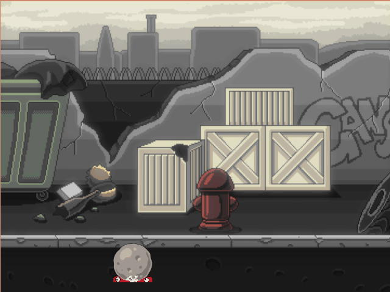

# rat-game



### Controls 
| Key | Control |
|-----|---------|
| w   | left    |
| d   | right   |
| F2  | restart |
| q   | quit    |

## Run

### From Release
1. Unzip rat-game.tar.gz: `tar xf rat-game.tar.gz && cd rat-game`
2. Run executable: `./rat-game-linux.run`

### From Source

After this project is in ~/quicklisp/local-projects/:

```lisp
(ql:quickload "rat-game")
(org.ratgame:launch)
```

## Building

Start sbcl (outside of emacs)
```sh
sbcl --dynamic-memory-size 4Gb
```

```lisp
(ql:quickload "rat-game")
(asdf:make "rat-game")
```

```sh
tar --create -f rat-game.tar.gz --transform s/bin/rat-game/ bin/ 
```
